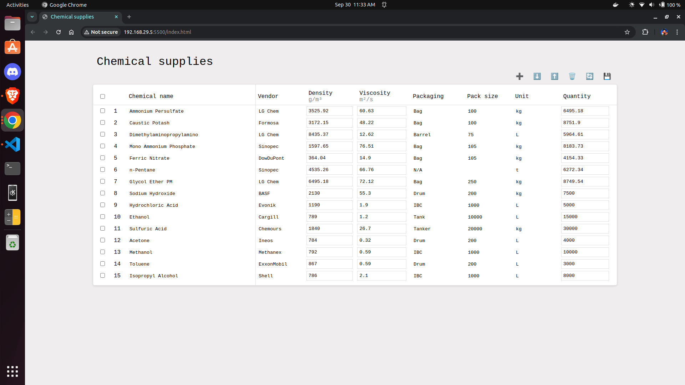

# Chemical Supplies Management

A web-based application for managing chemical supplies inventory. Features include:

- Interactive table for displaying chemical data
- Add, delete, and reorder rows
- Select multiple rows with checkboxes
- Save and refresh data
- Responsive design with CSS styling

## Technologies Used

- HTML
- CSS
- JavaScript

## Features

- Add new chemical entries
- Delete selected entries
- Move rows up and down
- Select all functionality
- Save and refresh data
- Display chemical properties including name, vendor, density, viscosity, packaging, and quantity

## Getting Started

1. Clone the repository
2. Open `index.html` in a web browser
